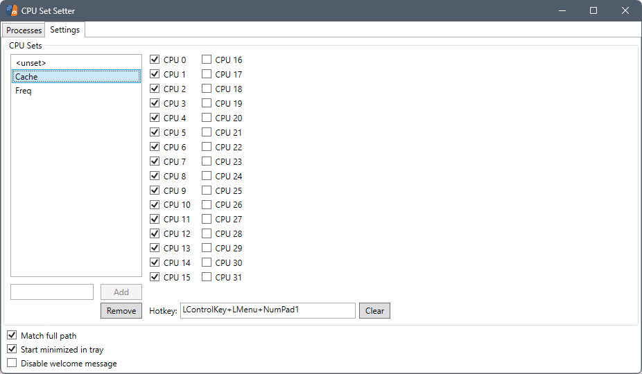

# CPU Set Setter

    

Make your games and apps run on the right CPU cores - for smoother performance on Dual-CCD AMD 3D V-Cache processors.

**Windows 11 required.**

## What it does
Dual CCD 3D V-Cache CPUs like the 9950X3D, 9900X3D, 7950X3D and 7900X3D have two kinds of cores:
- Cache cores (CCD0): More cache, great for gaming.
- Frequency cores (CCD1): Higher clock speeds, better for productivity and background tasks.

By default, Windows and AMD's driver try to achieve better gaming performance by **turning off** the Frequency cores (called parking) - but this can sometimes hurt performance, especially when gaming and multitasking simultaneously. CPU Set Setter gives you control: you decide which cores your games and apps use.

This tool is inspired by Process Lasso, bringing quick and easy access to CPU Sets for free, and also providing Hotkey support to change/clear CPU Sets on the fly, so you can experiment without having to leave your game.

## Use cases
- Keep your game locked to Cache cores for maximum FPS.
- Let background apps (OBS, video editors, browsers) use the Frequency cores.
- Avoid the FPS drops caused by Windows putting everything on Cache cores.
- Hotkeys let you assign CPU Sets to the current foreground process, allowing you to quickly test what performs best while staying in-game.

## Quick start
**Prerequisite (not technically required, but HIGHLY recommended)**
- CPPC Preferred Cores (in BIOS): Driver or Frequency 
- Global C-State Control (in BIOS): Enabled
- X3D Gaming/Turbo Mode (in BIOS): Disabled
- Game Mode (Windows Settings > Gaming > Game Mode): Off
> [!CAUTION]
> **IMPORTANT!** When using this on games, **always** disable Windows Game Mode. Even if CPPC Preferred Cores is set to Frequency instead of Driver. Performance reductions may occur when Game Mode is left enabled.

If you're on a supported dual-CCD CPU (9950X3D, 9900X3D, 7950X3D, 7900X3D), CPU Set Setter will auto-create a "Cache" and "Freq" CPU Set for you. Just:
1. Download the [latest Release](https://github.com/SimonvBez/CPUSetSetter/releases/latest), extract and run.
2. Open the **Processes tab**.
3. Apply the "Cache" CPU Set to your open game.
4. (Optional) Apply the "Freq" CPU Set to heavy background apps like OBS.
5. Done - your choices are saved and auto-applied next time, as long as CPU Set Setter is running.
6. (Optional) Run `CreateStartupTask.bat` to make CPU Set Setter start automatically when your computer starts

If you're on another CPU or want to otherwise tweak which cores can be used, you can create/modify your own CPU Set in **Settings**:
- Name your CPU Set, Add it and Pick the cores you want for it

## Screenshots

## Performance results
In my testing, I found that game performance in combination with background work is significantly better with CPU Sets and Game Mode Off, than with the 'default' Driver core parking.

**Test conditions**:
- CPPC Preferred Cores (in BIOS) always set to Driver
- Windows Power Plan set to Balanced
- 9950X3D + RTX5090, all 1080p native (no FSR/DLSS upscaling)

**Variables**:
- "CPU Set Cache locking": Game Mode off, CCD0 (Cache) CPU Set applied to game
- "Driver locking": Game Mode on, no manual CPU Set
- "No background tasks": As little background programs running as possible
- "With 7zip benchmark": NanaZip 5.0 U2 benchmark with 6 threads and 32MB dict size running in background, CCD1 (Freq) CPU Set applied to 7z benchmark

**Far Cry 6** benchmark Medium preset

|                     | CPU Set Cache locking                                                                                              | Driver locking                                                                                 |
|---------------------|--------------------------------------------------------------------------------------------------------------------|------------------------------------------------------------------------------------------------|
| No background tasks | Avg: 296.7 FPS Min: 241.6 FPS Max: 365.8 FPS 1% Low: 221.1 FPS 0.1% Low: 133.1 FPS                     | Avg: 292.4 FPS Min: 235.8 FPS Max: 366.2 FPS 1% Low: 213.5 FPS 0.1% Low: 139.7 FPS |
| With 7zip benchmark | Avg: **296.5 FPS** Min: **238.0 FPS** Max: **360.3 FPS** 1% Low: **216.5 FPS** 0.1% Low: **132.6 FPS** | Avg: 232.0 FPS Min: 175.9 FPS Max: 294.5 FPS 1% Low: 163.3 FPS 0.1% Low: 106.3 FPS |

**Cyberpunk 2077 Cyber Liberty v2.3** benchmark Medium preset, NVIDIA Reflex turned off

|                     | CPU Set Cache locking                                                                                              | Driver locking                                                                                 |
|---------------------|--------------------------------------------------------------------------------------------------------------------|------------------------------------------------------------------------------------------------|
| No background tasks | Avg: 279.0 FPS Min: 214.3 FPS Max: 316.7 FPS 1% Low: 190.6 FPS 0.1% Low: 160.1 FPS                     | Avg: 267.5 FPS Min: 200.0 FPS Max: 305.1 FPS 1% Low: 172.1 FPS 0.1% Low: 140.5 FPS     |
| With 7zip benchmark | Avg: **270.6 FPS** Min: **207.3 FPS** Max: **309.1 FPS** 1% Low: **176.2 FPS** 0.1% Low: **135.5 FPS** | Avg: 216.9 FPS Min: 172.7 FPS Max: 243.0 FPS 1% Low: 142.7 FPS 0.1% Low: 107.2 FPS |

## CPU Sets vs Affinity
CPU Sets are very similar to Affinities, but come with some subtle differences:
- **Affinity** = Hard lock (some games crash/freeze)
- **CPU Set** = Very strong hint but may be deviated from when necessary (more stable, works with more games)
- Bonus: CPU Sets require fewer process privileges to set, allowing them to work in games with anti-cheats too
